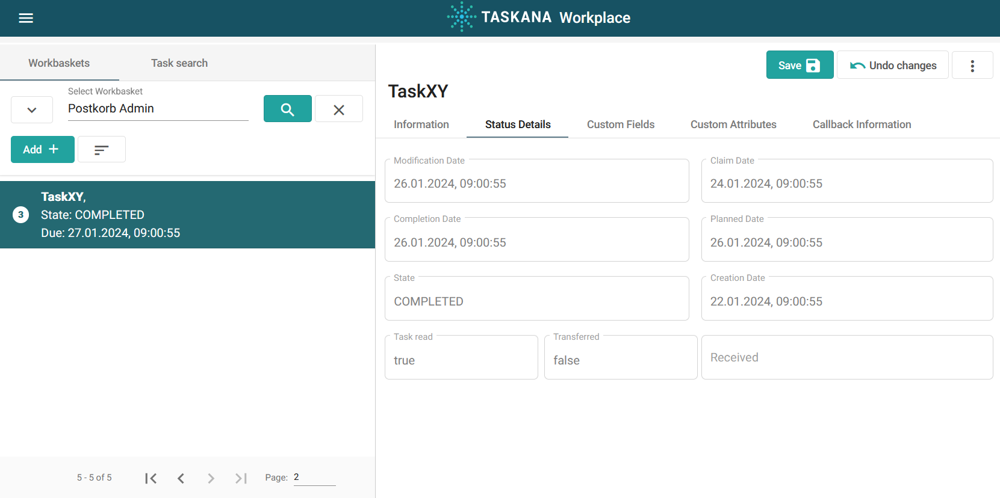

# Demo App

While our main focus remains ob the backend of TASKANA, we additionaly provide an example frontend in form of a Demo App. This is only an example, as TASKANA frontend can be implemented differently for specific use cases. Here is what the demo app looks like: 

### [Click here to go to the Demo App](https://taskana.azurewebsites.net/taskana)

## Try out the Demo App

In order to login as admin, you need to use the following credentials:
> username: admin
>
> password: admin

Then, you will be forwarded to the **TASKANA Administration**. There are also other users available. 

### Navigation in the Demo App
To navigate between different pages, select the menu using the three point icon on the upper left. Then, you can choose between the categories shown in the bucket list below.

- **Administration**
    - Manage Workbaskets
    - Manage Classifications
    - Perform other admin activities
- **Monitor**
    - Observe current state of work
- **Workplace**
    - See available Tasks
    - Perform actions on Tasks
- **History**
    - Observe actions performed by TASKANA in the past
- **Settings**

