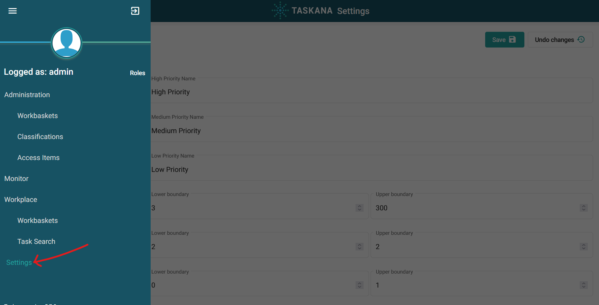

# Priority Report

TASKANA provides the possibility to customize Priority Reports in the UI. To configure it, go to “Settings” in the TASKANA UI. 

Currently the UI supports the following types of parameters: 

|Type     | What the UI shows                                          |Usage
|---------|------------------------------------------------------------|-----
|text     |an input field where text can be typed in                   |Priority names
|interval |two input fields for numbers, a lower and an upper boundary |Priority intervals
|color    |a color picker                                              |Priority colors
|json     |a text area where a string in json format can be typed in.  |Filter values

### Placement of this configuration in TASKANA
The parameters described above are saved in the CONFIGURATION table under CUSTOM_ATTRIBUTES. The data structure is divided in two parts: The fields with their corresponding values and a field named “schema”. That field contains all information which is needed in the UI to display those parameters. The default values can be found there.
