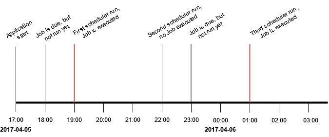

# TASKANA-jobs

Jobs are automated processes that run in the background of the application, usually periodically. They are scheduled for configurable times and then run by the scheduler. For example, the TaskCleanupJob deletes Tasks after they reached a certain time passed after their completion. You can read more about jobs [here](../features/jobs.md). 
Common options for jobs customization are listed and explained as following:
- **Batch size**: Maximum number of entities that are processed in one job
- **Max number of retries**: Maximum number of retries if a job fails 
- **First run at**: The date for the first run of the job
- **Run every**: The interval between individual runs of a job

Additionally, different jobs have other special parameters for customization which can be found below.
There is an example job configuration and execution at the end of this article.

You can also configure the scheduler. The scheduler will initialize the first schedule for the jobs. Each run, the scheduler looks up which jobs are past their due date. These jobs get executed. The behavior of jobs and the scheduler in TASKANA can be customized in the configuration file ```taskana.properties``` with the following parameters:

## Scheduler Configuration
| Parameter                                | Description                                                    | Default Value |
|------------------------------------------|----------------------------------------------------------------|---------------|
| taskana.jobs.scheduler.enabled           | Enabling automated scheduling of jobs                          | true          |
| taskana.jobs.scheduler.initialStartDelay | Start delay before the first job gets scheduled                | 100           |
| taskana.jobs.scheduler.period            | The time interval between the individual runs of the scheduler | 5             |
| taskana.jobs.scheduler.periodTimeUnit    | The unit for scheduler.initialStartDelay and scheduler.period  | MINUTES       |

## General Jobs Configuration 
This configuration options are overwritten by job specific configuration options

| Parameter               | Description                                                                 | Default Value        |
|-------------------------|-----------------------------------------------------------------------------|----------------------|
| taskana.jobs.maxRetries | number of automatic retries after a job has failed                          | 3                    |
| taskana.jobs.batchSize  | upper bound of how many tasks can be processed by one job                   | 100                  |
| taskana.jobs.runEvery   | period of time between the executions of jobs (Duration in ISO 8601 format) | P1D                  |
| taskana.jobs.firstRunAt | first time the job is run (DateTime n ISO 8601 format)                      | 2023-01-01T00:00:00Z |
| taskana.jobs.lockExpirationPeriod | period of time the lock is valid (Duration in ISO 8601 format). Should be longer than the longest possible job execution time                      | P2D | PT30M |

## TaskCleanupJob Configuration

| Parameter                                                          | Description                                                                                                                                 | Default Value |
|--------------------------------------------------------------------|---------------------------------------------------------------------------------------------------------------------------------------------|---------------|
| taskana.jobs.cleanup.task.enable                                   | Enabling automated cleanup of completed tasks after a period of time specified by job.runEvery                                              | true          |
| taskana.jobs.cleanup.task.minimumAge                               | the completed task can be deleted by the cleanup only after this period of time or later  (Duration in ISO 8601 format)                     | P14D          |
| taskana.jobs.cleanup.task.allCompletedSameParentBusiness           | Prevent deletion of tasks if other tasks with same parent business process ID are not yet completed                                         | true          |
| taskana.jobs.cleanup.task.lockExpirationPeriod           | period of time the lock is valid (Duration in ISO 8601 format). Should be longer than the longest possible job execution time                                         | PT30M          |

## WorkbasketCleanupJob Configuration


| Parameter                                                          | Description                                                                                                                                 | Default Value |
|--------------------------------------------------------------------|---------------------------------------------------------------------------------------------------------------------------------------------|---------------|
| taskana.jobs.cleanup.workbasket.enable                             | Enable WorkbasketCleanupJob to cleanup completed workbaskets after a period of time if no pending tasks                                     | true          |
| taskana.jobs.cleanup.workbasket.lockExpirationPeriod                             | period of time the lock is valid (Duration in ISO 8601 format). Should be longer than the longest possible job execution time                                     | PT30M          |

## HistoryCleanupJob Configuration

| Parameter                                                          | Description                                                                                                                                 |  Default Value |
|--------------------------------------------------------------------|---------------------------------------------------------------------------------------------------------------------------------------------|---------------|
| taskana.jobs.cleanup.history.simple.enable                         | Enables the HistoryCleanupJob to delete history events                                                                                      | false         |
| taskana.jobs.cleanup.history.simple.minimumAge                     | a history event may only be deleted by the cleanup after this period of time or later  (Duration in ISO 8601 format)              |  P14D          |
| taskana.jobs.cleanup.history.simple.batchSize                      | upper bound of how many history events can be processed by one history cleanup job                                                          | 100           |
| taskana.jobs.cleanup.history.simple.allCompletedSameParentBusiness | Prevent deletion of Task History Events if other Task History Events with same parent business process ID have types other than "CREATED" 	 | true          |
| taskana.jobs.cleanup.history.simple.lockExpirationPeriod | period of time the lock is valid (Duration in ISO 8601 format). Should be longer than the longest possible job execution time 	 |  PT30M          |


## TaskUpdatePriorityJob Configuration


| Parameter                             | Description                                                                                      |  Default Value        |
|---------------------------------------|--------------------------------------------------------------------------------------------------|-----------------------|
| taskana.jobs.priority.task.enable     | Enabling automated recalculation of priority of each tasks that is not in an endstate            |  false                |
| taskana.jobs.priority.task.batchSize  | upper bound of how many tasks can be processed by one TaskUpdatePriorityJob                      |  100                  |
| taskana.jobs.priority.task.runEvery   | period of time between the executions of the TaskUpdatePriorityJob (Duration in ISO 8601 format) |  P1D                  |
| taskana.jobs.priority.task.firstRunAt | first time the job is executed (DateTime in ISO 8601 format)                                     |  2023-01-01T00:00:00Z |
| taskana.jobs.priority.task.lockExpirationPeriod     | period of time the lock is valid (Duration in ISO 8601 format). Should be longer than the longest possible job execution time                                        |  PT30M             |

## UserInfoRefreshJob Configuration


| Parameter                            | Description                                                                                   | Default Value        |
|--------------------------------------|-----------------------------------------------------------------------------------------------|----------------------|
| taskana.jobs.refresh.user.enable     | Enable job to refresh all user info after a period of time                                    | false                |
| taskana.jobs.refresh.user.runEvery   | period of time between the executions of the UserInfoRefreshJob (Duration in ISO 8601 format) | P1D                  |
| taskana.jobs.refresh.user.firstRunAt | first time the job is executed (DateTime in ISO 8601 format)                                  | 2023-01-01T23:00:00Z |
| taskana.jobs.refresh.user.lockExpirationPeriod | period of time the lock is valid (Duration in ISO 8601 format). Should be longer than the longest possible job execution time                               | PT30M |

## CustomJobs Configuration

| Parameter               | Description                                            | Default Value |
|-------------------------|--------------------------------------------------------|---------------|
| taskana.jobs.customJobs | Initialize custom jobs by specifying path to job class |               |

## Example
**Setup**:

```
taskana.jobs.scheduler.enabled=true
taskana.jobs.scheduler.initialStartDelay=2
taskana.jobs.scheduler.period=3
taskana.jobs.scheduler.periodTimeUnit=HOURS
taskana.jobs.refresh.user.firstRunAt=2017-04-05T18:00:00Z
taskana.jobs.refresh.user.runEvery=P4H
```

**Result** (assuming refresh user job is the only active job):

