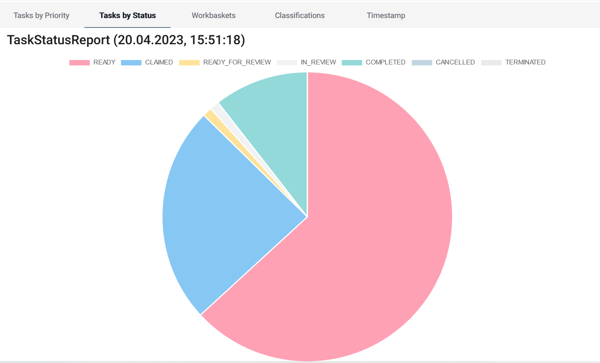

# Monitoring

Monitoring is a real time obervation of the current state of work. It allows to view and evaluate the status of the team, thus relevant for teamlead to monitor whether all tasks are completed on time. Monitoring also provides the possibility to see what work is due in the next few days so that it can be taken into account when staffing.

The data shown by the monitoring includes Tasks and their attributes, like Workbaskets, status, age etc. Tasks fullfilling certain criterias are counted in order to create a statistic representing all current Tasks and their attributes. An example of this can be seen below.

This screenshot shows one of the representations that can be created by the Monitor. It's a table that sums up the number of Tasks by the day of due date and their Workbasket. This table is visualized in the diagram provided by TASKANA UI.

There are other options for filtering and aggregating Tasks in the TASKANA Monitor. You can see them in detail by swithing tabs in the [monitoring UI](https://taskana.mybluemix.net/taskana/#/taskana/monitor/tasks-priority) as part of our demo application. The username and password for the demo application are "admin" and "admin".

Some of the data is additionaly visualized. For example, you can see Tasks divided by their status in a pie chart in TASKANA UI:

