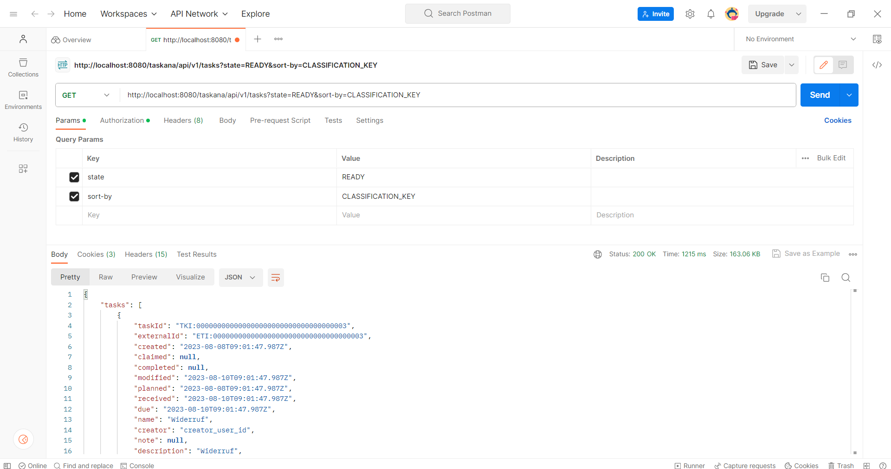

# Queries: Filtering and Sorting

You can get a list of Tasks, Workbaskets, Classifications, Users and other resources using TASKANA queries. They allow filtering and sorting according to different criterias, e. g. priority, owner, etc. Queries can be executed using the REST-API or the Java-API. 

## Query usage in the REST-API
TASKANA provides a REST-API described [here](../core-concepts/rest-api). You should use HTTP GET method in order to execute a query. Query parameters for filtering and sorting are specified in the HTTP request after "?". For example, the following request will return all Tasks that are owned by *user-1-1* or *user-1-2*:
```
GET http://localhost:8080/taskana/api/v1/tasks?owner-in=user-1-1&owner-in=user-1-2
```

You can try querying using Postman like in our [Spring Boot example](../getting-started/spring-boot-example%20copy.md#step-5--try-out-the-rest-api).
Here is an example of the query from our [REST-API doc](../core-concepts/rest-api) using Postman:



More about queries using the REST-API can be found in the [REST-API Documentation](https://taskana.azurewebsites.net/taskana/docs/rest/rest-api.html).

# Query in JAVA-API
You can also execute queries using the [JAVA-API](../core-concepts/java-api-usage.md) of TASKANA. To do that, create a query using the service of the relevant entity. Then, add filtering and sorting parameters to your query and execute it. When querying for Tasks, you need to use ``TaskService.createTaskQuery()``. You can find the query filter and sorting parameters under ``pro.taskana.TaskQuery.api``.
Here is an example of a query that returns Tasks owned by *user-1-1* or *user-1-2* sorted by the business process id of the Task:
```language
List<TaskSummary> tasks = taskService.createTaskQuery()
                        .ownerIn("user-1-1","user-1-2").orderByBusinessProcessId(SortDirection.ASCENDING)
                        .list();
```
