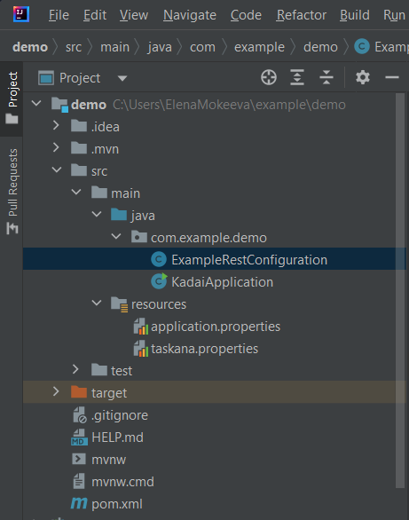
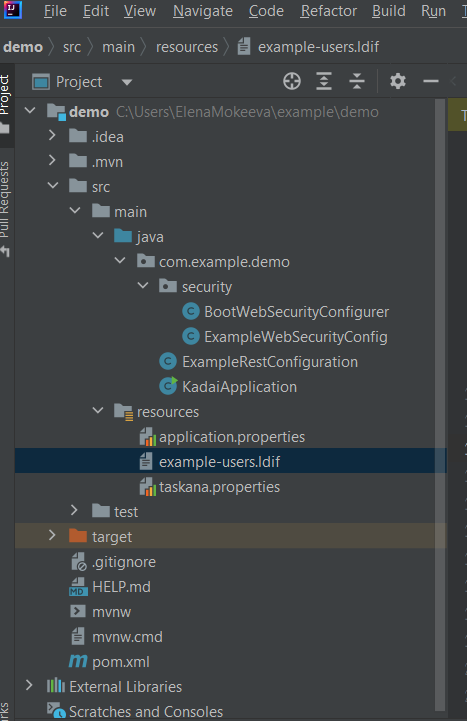
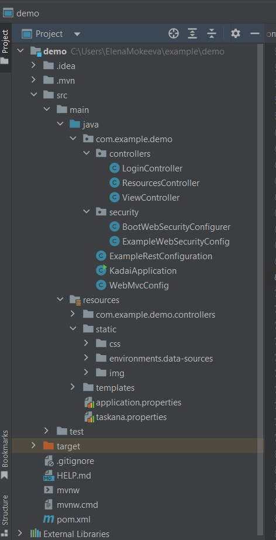
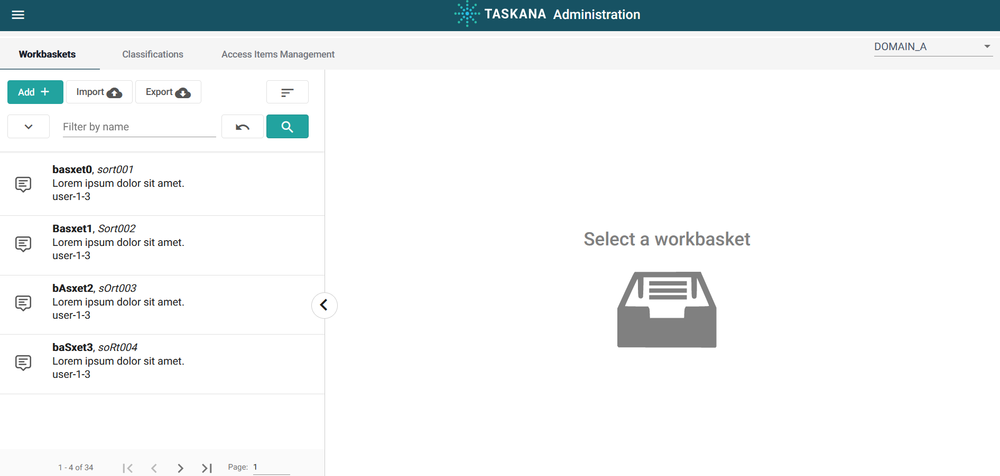
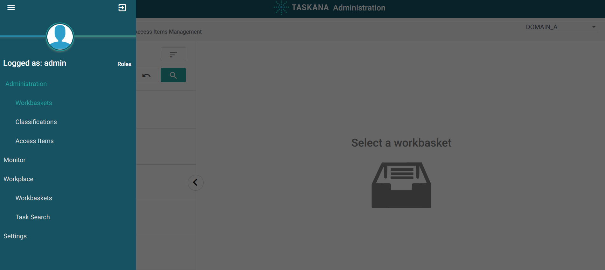

# Example Spring Boot

In the first 4 steps, we will set up Kadai REST API without security. Then, we will show how to use
the resulting REST API with [postman](https://www.postman.com/). This guide then sets up security.
In the end of the guide, we will add the UI.

import styles from '../../../src/components/HomepageFeatures/styles.module.css';
import Link from '@docusaurus/Link';

## What you'll need

In order to set up the example, please install:

- an IDE of your choice (preferably IntelliJ)
- Java 11
- maven
- optional: [postman](https://www.postman.com/) (makes REST API requests easier)

Note: Please name your packages, folders and files exactly like in the example!

## Set up Kadai REST-API without security

### Step 1: Initialize an empty project

Go to [Spring Initializer](https://start.spring.io/) and create an example Maven Project. Choose the
same options as in the Screenshot, except the spring version. Please check Java 11, then click on "
Generate".


Unpack the project in the folder of your choice and open it in IntelliJ


### Step 2: Add dependencies

Please add following dependencies to the pom. All dependencies can be copied as one block at the end
of step 2. After adding the dependencies, please reload maven and recompile the project.

** 1. spring core depenpendency: **

```
<dependency>
    <groupId>org.springframework.plugin</groupId>
    <artifactId>spring-plugin-core</artifactId>
    <version>2.0.0.RELEASE</version>
</dependency>
```

** 2. database dependencies: **

```
<dependency>
    <groupId>com.h2database</groupId>
    <artifactId>h2</artifactId>
</dependency>
<dependency>
    <groupId>org.springframework.boot</groupId>
    <artifactId>spring-boot-starter-jdbc</artifactId>
</dependency>
```

** 3. taskana dependencies: **

```
<dependency>
    <groupId>pro.taskana</groupId>
    <artifactId>taskana-common-data</artifactId>
    <version>6.0.2</version>
</dependency>
<dependency>
    <groupId>pro.taskana</groupId>
    <artifactId>taskana-common-logging</artifactId>
    <version>6.0.2</version>
</dependency>
<dependency>
    <groupId>pro.taskana</groupId>
    <artifactId>taskana-rest-spring</artifactId>
    <version>6.0.2</version>
</dependency>
```

** 4. tomcat application server dependency: **

```
<dependency>
    <groupId>org.springframework.boot</groupId>
    <artifactId>spring-boot-starter-web</artifactId>
</dependency>
```

** All dependencies **

```
<dependency>
    <groupId>org.springframework.boot</groupId>
    <artifactId>spring-boot-starter-web</artifactId>
</dependency>
<dependency>
    <groupId>org.springframework.plugin</groupId>
    <artifactId>spring-plugin-core</artifactId>
    <version>2.0.0.RELEASE</version>
</dependency>
<dependency>
    <groupId>pro.taskana</groupId>
    <artifactId>taskana-common-logging</artifactId>
    <version>6.0.2</version>
</dependency>
<dependency>
    <groupId>pro.taskana</groupId>
    <artifactId>taskana-rest-spring</artifactId>
    <version>6.0.2</version>
</dependency>
<dependency>
    <groupId>pro.taskana</groupId>
    <artifactId>taskana-common-data</artifactId>
    <version>6.0.2</version>
</dependency>
<dependency>
    <groupId>com.h2database</groupId>
    <artifactId>h2</artifactId>
</dependency>
<dependency>
    <groupId>org.springframework.boot</groupId>
    <artifactId>spring-boot-starter-jdbc</artifactId>
</dependency>
```

### Step 3: Add properties configuration

#### Step 3a: Fill out application.properties

The example already has the configuration file ```application.properties``` in
the ``src/main/ressources`` folder. It's a standard configuration file used by spring. You can read
more about spring configuration in
the [spring documentation](https://docs.spring.io/spring-boot/docs/current/reference/html/application-properties.html).
You need to add following content into that file:

```
logging.level.pro.taskana=INFO
logging.level.org.springframework.security=INFO
server.servlet.context-path=/taskana
taskana.routing.dmn.upload.path=/tmp/routing.dmn
######## Taskana DB #######
######## h2 configuration ########
spring.datasource.url=jdbc:h2:mem:taskana;NON_KEYWORDS=KEY,VALUE;IGNORECASE=TRUE;DB_CLOSE_ON_EXIT=FALSE;LOCK_MODE=0
spring.datasource.driverClassName=org.h2.Driver
spring.datasource.username=sa
spring.datasource.password=sa
taskana.schemaName=TASKANA
######## h2 console configuration ########
########spring.h2.console.enabled=true
########spring.h2.console.path=/h2-console
######## db2 configuration ########
########spring.datasource.driverClassName=com.ibm.db2.jcc.DB2Driver
########spring.datasource.url=jdbc:db2://localhost:5101/tskdb
########spring.datasource.username=db2inst1
########spring.datasource.password=db2inst1-pwd
######## Postgres configuration ########
########spring.datasource.url=jdbc:postgresql://localhost:5102/taskana
########spring.datasource.driverClassName=org.postgresql.Driver
########spring.datasource.username=postgres
########spring.datasource.password=1234
########spring.jpa.generate-ddl=true
########spring.jpa.properties.hibernate.jdbc.lob.non_contextual_creation=true
####### property that control rest api security deploy use true for no security.
devMode=true
# This property enables the support of XSRF tokens. This will not work together with devMode.
enableCsrf=false
####### property that control if the database is cleaned and sample data is generated
generateSampleData=true
####### JobScheduler cron expression that specifies when the JobSchedler runs
taskana.jobscheduler.async.cron=0 * * * * *
####### cache static resources properties
spring.web.resources.cache.cachecontrol.cache-private=true
####### for upload of big workbasket- or classification-files
spring.servlet.multipart.max-file-size=10MB
spring.servlet.multipart.max-request-size=10MB
####### serve compressed files for faster UI loading times
server.compression.enabled=true
server.compression.mime-types=application/json,application/xml,text/html,text/xml,text/plain,application/javascript,text/css,image/svg+xml
server.compression.min-response-size=10240
spring.main.allow-bean-definition-overriding=true
server.tomcat.max-http-form-post-size=-1
server.tomcat.max-save-post-size=-1
server.tomcat.max-swallow-size=-1
####### tomcat is not detecting the x-forward headers from bluemix as a trustworthy proxy
server.tomcat.remoteip.internal-proxies=.*
server.forward-headers-strategy=native
####### Properties for AccessIdController to connect to LDAP
taskana.ldap.serverUrl=ldap://localhost:10389
taskana.ldap.bindDn=uid=admin
taskana.ldap.bindPassword=secret
taskana.ldap.baseDn=ou=Test,O=TASKANA
taskana.ldap.userSearchBase=cn=users
taskana.ldap.userSearchFilterName=objectclass
taskana.ldap.userSearchFilterValue=person
taskana.ldap.userFirstnameAttribute=givenName
taskana.ldap.userLastnameAttribute=sn
taskana.ldap.userFullnameAttribute=cn
taskana.ldap.userPhoneAttribute=phoneNumber
taskana.ldap.userMobilePhoneAttribute=mobileNumber
taskana.ldap.userEmailAttribute=email
taskana.ldap.userOrglevel1Attribute=orgLevel1
taskana.ldap.userOrglevel2Attribute=orgLevel2
taskana.ldap.userOrglevel3Attribute=someDepartement
taskana.ldap.userOrglevel4Attribute=orgLevel4
taskana.ldap.userIdAttribute=uid
taskana.ldap.userMemberOfGroupAttribute=memberOf
taskana.ldap.groupSearchBase=
taskana.ldap.groupSearchFilterName=objectclass
taskana.ldap.groupSearchFilterValue=groupofuniquenames
taskana.ldap.groupNameAttribute=cn
taskana.ldap.minSearchForLength=3
taskana.ldap.maxNumberOfReturnedAccessIds=50
taskana.ldap.groupsOfUser=uniquemember
# Embedded Spring LDAP server
spring.ldap.embedded.base-dn=OU=Test,O=TASKANA
spring.ldap.embedded.credential.username=uid=admin
spring.ldap.embedded.credential.password=secret
spring.ldap.embedded.ldif=classpath:example-users.ldif
spring.ldap.embedded.port=10389
spring.ldap.embedded.validation.enabled=false
```

#### Step 3b: Add taskana.properties

Create ```taskana.properties``` in the resources folder. This file contains taskana specific
configuration, like custom holidays etc. You can look up more configuration
options [here (general options)](../configuration/taskana-properties/properties-configuration.md)
and [here (specific options)](../configuration/taskana-properties/jobs-configuration.md). Please
copy following content into ```taskana.properties```:

```
taskana.roles.user=cn=ksc-users,cn=groups,OU=Test,O=TASKANA | teamlead-1 | teamlead-2 | user-1-1 | user-1-2 | user-2-1 | user-2-2 | user-b-1 | user-b-2
taskana.roles.admin=admin | uid=admin,cn=users,OU=Test,O=TASKANA
taskana.roles.business_admin=businessadmin | cn=business-admins,cn=groups,OU=Test,O=TASKANA
taskana.roles.monitor=monitor | cn=monitor-users,cn=groups,OU=Test,O=TASKANA
taskana.roles.task_admin=taskadmin
taskana.domains=DOMAIN_A|DOMAIN_B|DOMAIN_C|DOMAIN_TEST
taskana.user.minimalPermissionsToAssignDomains=READ | OPEN
taskana.classification.types=TASK|DOCUMENT
taskana.classification.categories.task=EXTERNAL| manual| autoMAtic| Process
taskana.classification.categories.document=EXTERNAL
taskana.jobs.maxRetries=3
taskana.jobs.batchSize=50
taskana.jobs.runEvery=P1D
taskana.jobs.firstRunAt=2018-07-25T08:00:00Z
taskana.jobs.cleanup.task.minimumAge=P14D
taskana.jobs.cleanup.history.simple.batchSize=50
taskana.jobs.history.cleanup.firstRunAt=2018-07-25T08:00:00Z
taskana.jobs.cleanup.history.simple.minimumAge=P14D
taskana.jobs.history.cleanup.runEvery=P1D
taskana.jobs.refresh.user.runEvery=P1D
taskana.jobs.refresh.user.firstRunAt=2018-07-25T23:00:00Z
taskana.workingTime.holidays.german.enabled=true
taskana.workingTime.holidays.german.corpus-christi.enabled=true
taskana.history.logger.name=AUDIT
taskana.routing.dmn=/dmn-table.dmn
# enable or disable the jobscheduler at all
# set it to false and no jobs are running
taskana.jobs.scheduler.enabled=false
# wait time before the first job run in millis
taskana.jobs.scheduler.initialStartDelay=100
# sleeping time befor the next job runs
taskana.jobs.scheduler.period=12
# timeunit for the sleeping period
# Possible values: MILLISECONDS, SECONDS, MINUTES, HOURS, DAYS
taskana.jobs.scheduler.periodTimeUnit=HOURS
taskana.jobs.cleanup.task.enable=true
taskana.jobs.priority.task.enable=true
taskana.jobs.cleanup.workbasket.enable=true
taskana.jobs.refresh.user.enable=true
taskana.jobs.cleanup.history.simple.enable=false
```

### Step 4: Add rest configuration

First, Add ```@ComponentScan({"pro.taskana","com.example"})``` as annotation above the class
definition of the ExampleApplication and acorresponding import to this class. This will allow the
apllication to find needed components.

Then, create a java class with the name ```ExampleRestConfiguration``` in the com.example.demo
package. This class defines the Beans and their dependencies. Your project structure should look
like this:



Copy following content into ```ExampleRestConfiguration.java```:

```
package com.example.demo;

import java.sql.SQLException;
import javax.sql.DataSource;
import org.h2.tools.Server;
import org.springframework.beans.factory.annotation.Value;
import org.springframework.context.annotation.Bean;
import org.springframework.context.annotation.Configuration;
import org.springframework.context.annotation.DependsOn;
import org.springframework.jdbc.datasource.DataSourceTransactionManager;
import org.springframework.transaction.PlatformTransactionManager;
import pro.taskana.TaskanaConfiguration;
import pro.taskana.common.api.TaskanaEngine;
import pro.taskana.common.internal.configuration.DbSchemaCreator;
import pro.taskana.sampledata.SampleDataGenerator;

@Configuration
public class ExampleRestConfiguration {

  @Bean
  public PlatformTransactionManager txManager(DataSource dataSource) {
    return new DataSourceTransactionManager(dataSource);
  }

  @Bean
  @DependsOn("taskanaConfiguration") // generate sample data after schema was inserted
  public SampleDataGenerator generateSampleData(
      TaskanaConfiguration taskanaConfiguration,
      DataSource dataSource,
      @Value("${generateSampleData:true}") boolean generateSampleData)
      throws SQLException {
    DbSchemaCreator dbSchemaCreator =
        new DbSchemaCreator(dataSource, taskanaConfiguration.getSchemaName());
    dbSchemaCreator.run();
    SampleDataGenerator sampleDataGenerator =
        new SampleDataGenerator(dataSource, taskanaConfiguration.getSchemaName());
    if (generateSampleData) {
      sampleDataGenerator.generateSampleData();
    }
    return sampleDataGenerator;
  }

  @Bean
  @DependsOn("generateSampleData")
  public TaskanaEngine getTaskanaEngine(TaskanaConfiguration taskanaConfiguration)
      throws SQLException {
    return TaskanaEngine.buildTaskanaEngine(taskanaConfiguration);
  }

  // only required to let the adapter example connect to the same database
  @Bean(initMethod = "start", destroyMethod = "stop")
  public Server inMemoryH2DatabaseaServer() throws SQLException {
    return Server.createTcpServer("-tcp", "-tcpAllowOthers", "-tcpPort", "9095");
  }
  
  @Bean
  @ConditionalOnMissingBean(TaskanaConfiguration.class)
  public TaskanaConfiguration taskanaConfiguration(
      DataSource dataSource,
      @Qualifier("taskanaPropertiesFileName") String propertiesFileName,
      @Qualifier("taskanaPropertiesDelimiter") String delimiter) {
    return new TaskanaConfiguration.Builder(dataSource, true, "TASKANA")
        .initTaskanaProperties(propertiesFileName, delimiter)
        .build();
  }
}


```

### Step 5: Try out the REST-API

Recompile the project and then start the DemoApplication in your IDE. You can now make following
request:

```
GET http://localhost:8080/taskana/api/v1/classifications
```

You should get a list of different Classifications in the body of the response. Here is a screenshot
of the request and the response in [postman](https://www.postman.com/):


You can also request Tasks using following command:

```
GET http://localhost:8080/taskana/api/v1/tasks
```

At this point, full Kadai REST-API functionality is available without security or authorization.
They will be added in the next steps.

## Set up Kadai Security

Our example application uses [ldap](https://ldap.com/learn-about-ldap/) for its authorization.
First, add a ```security``` package into the ```com.example.demo``` package (in
src/main/java/com/example/demo). The package will consist of one configurer class:
BootWebSecurityConfigurer (will be replaced), and one example configuration
ExampleWebSecurityConfig. The classes will be created in the next steps.

### Step 6: Add security dependencies and stop disabling security

Add following dependencies to your pom and reload maven:

```
<dependency>
    <groupId>org.springframework.ldap</groupId>
    <artifactId>spring-ldap-core</artifactId>
</dependency>
<dependency>
    <groupId>org.springframework.security</groupId>
    <artifactId>spring-security-ldap</artifactId>
</dependency>
<dependency>
    <groupId>com.unboundid</groupId>
    <artifactId>unboundid-ldapsdk</artifactId>
</dependency>
<dependency>
    <groupId>org.springframework.boot</groupId>
    <artifactId>spring-boot-starter-security</artifactId>
</dependency>
```

Then, set the ``devMode`` property in ``application.properties`` to false. This enables
authorization checks.
You also need to remove following lines from the ``ExampleRestConfiguration.java``:

```
 @Bean
@ConditionalOnMissingBean(TaskanaConfiguration.class)
public TaskanaConfiguration taskanaConfiguration(
    DataSource dataSource,
    @Qualifier("taskanaPropertiesFileName") String propertiesFileName,
    @Qualifier("taskanaPropertiesDelimiter") String delimiter) {
  return new TaskanaConfiguration.Builder(dataSource, true, "TASKANA")
      .initTaskanaProperties(propertiesFileName, delimiter)
      .build();
}
```

This way, you don't disable security manually.
Deleted because TaskanaEngineConfiguration doesn't exist anymore

### Step 7: Add BootWebSecurityConfigurer.java

Create ```BootWebSecurityConfigurer.java``` in the security folder and copy following content into
it:

```
package com.example.demo.security;

import java.util.List;
import java.util.Map;
import java.util.function.Function;
import org.springframework.beans.factory.annotation.Value;
import org.springframework.context.annotation.Bean;
import org.springframework.context.annotation.Configuration;
import org.springframework.http.HttpMethod;
import org.springframework.ldap.core.support.BaseLdapPathContextSource;
import org.springframework.security.authentication.AuthenticationManager;
import org.springframework.security.config.annotation.web.builders.HttpSecurity;
import org.springframework.security.config.ldap.LdapPasswordComparisonAuthenticationManagerFactory;
import org.springframework.security.core.GrantedAuthority;
import org.springframework.security.core.authority.SimpleGrantedAuthority;
import org.springframework.security.core.authority.mapping.GrantedAuthoritiesMapper;
import org.springframework.security.core.authority.mapping.SimpleAuthorityMapper;
import org.springframework.security.crypto.password.NoOpPasswordEncoder;
import org.springframework.security.ldap.DefaultSpringSecurityContextSource;
import org.springframework.security.ldap.userdetails.DefaultLdapAuthoritiesPopulator;
import org.springframework.security.ldap.userdetails.LdapAuthoritiesPopulator;
import org.springframework.security.web.SecurityFilterChain;
import org.springframework.security.web.csrf.CookieCsrfTokenRepository;
import org.springframework.security.web.jaasapi.JaasApiIntegrationFilter;
import org.springframework.security.web.util.matcher.AntPathRequestMatcher;
import pro.taskana.common.rest.SpringSecurityToJaasFilter;

/** Default basic configuration for taskana web example. */
@Configuration
public class BootWebSecurityConfigurer {

  private final String ldapServerUrl;
  private final String ldapBaseDn;
  private final String ldapUserDnPatterns;
  private final String ldapGroupSearchBase;
  private final String ldapGroupSearchFilter;

  private final boolean devMode;
  private final boolean enableCsrf;

  public BootWebSecurityConfigurer(
      @Value("${taskana.ldap.serverUrl:ldap://localhost:10389}") String ldapServerUrl,
      @Value("${taskana.ldap.baseDn:OU=Test,O=TASKANA}") String ldapBaseDn,
      @Value("${taskana.ldap.userDnPatterns:uid={0},cn=users}") String ldapUserDnPatterns,
      @Value("${taskana.ldap.groupSearchBase:cn=groups}") String ldapGroupSearchBase,
      @Value("${taskana.ldap.groupSearchFilter:uniqueMember={0}}") String ldapGroupSearchFilter,
      @Value("${enableCsrf:false}") boolean enableCsrf,
      @Value("${devMode:false}") boolean devMode) {
    this.enableCsrf = enableCsrf;
    this.ldapServerUrl = ldapServerUrl;
    this.ldapBaseDn = ldapBaseDn;
    this.ldapGroupSearchBase = ldapGroupSearchBase;
    this.ldapGroupSearchFilter = ldapGroupSearchFilter;
    this.ldapUserDnPatterns = ldapUserDnPatterns;
    this.devMode = devMode;
  }

  @Bean
  public SecurityFilterChain filterChain(HttpSecurity http) throws Exception {
    HttpSecurity httpSecurity =
        http.authorizeRequests()
            .antMatchers("/css/**", "/img/**")
            .permitAll()
            .and()
            .authorizeRequests()
            .antMatchers(HttpMethod.GET, "/docs/**")
            .permitAll()
            .and()
            .addFilter(jaasApiIntegrationFilter())
            .addFilterAfter(new SpringSecurityToJaasFilter(), JaasApiIntegrationFilter.class);

    if (enableCsrf) {
      CookieCsrfTokenRepository csrfTokenRepository = CookieCsrfTokenRepository.withHttpOnlyFalse();
      csrfTokenRepository.setCookiePath("/");
      httpSecurity.csrf().csrfTokenRepository(csrfTokenRepository);
    } else {
      httpSecurity.csrf().disable().httpBasic();
    }

    if (devMode) {
      http.headers()
          .frameOptions()
          .sameOrigin()
          .and()
          .authorizeRequests()
          .antMatchers("/h2-console/**")
          .permitAll();
    } else {
      addLoginPageConfiguration(http);
    }
    return http.build();
  }

  @Bean
  public LdapAuthoritiesPopulator authoritiesPopulator(
      DefaultSpringSecurityContextSource contextSource) {
    Function<Map<String, List<String>>, GrantedAuthority> authorityMapper =
        recordVar -> new SimpleGrantedAuthority(recordVar.get("spring.security.ldap.dn").get(0));

    DefaultLdapAuthoritiesPopulator populator =
        new DefaultLdapAuthoritiesPopulator(contextSource, ldapGroupSearchBase);
    populator.setGroupSearchFilter(ldapGroupSearchFilter);
    populator.setSearchSubtree(true);
    populator.setRolePrefix("");
    populator.setAuthorityMapper(authorityMapper);
    return populator;
  }

  @Bean
  @Primary
  public DefaultSpringSecurityContextSource defaultSpringSecurityContextSource() {
    return new DefaultSpringSecurityContextSource(ldapServerUrl + "/" + ldapBaseDn);
  }

  @Bean
  public GrantedAuthoritiesMapper grantedAuthoritiesMapper() {
    SimpleAuthorityMapper grantedAuthoritiesMapper = new SimpleAuthorityMapper();
    grantedAuthoritiesMapper.setPrefix("");
    return grantedAuthoritiesMapper;
  }

  protected void addLoginPageConfiguration(HttpSecurity http) throws Exception {
    http.authorizeRequests()
        .anyRequest()
        .fullyAuthenticated()
        .and()
        .formLogin()
        .loginPage("/login")
        .failureUrl("/login?error")
        .defaultSuccessUrl("/")
        .permitAll()
        .and()
        .logout()
        .invalidateHttpSession(true)
        .clearAuthentication(true)
        .logoutRequestMatcher(new AntPathRequestMatcher("/logout"))
        .logoutSuccessUrl("/login?logout")
        .deleteCookies("JSESSIONID")
        .permitAll();
  }

  protected JaasApiIntegrationFilter jaasApiIntegrationFilter() {
    JaasApiIntegrationFilter filter = new JaasApiIntegrationFilter();
    filter.setCreateEmptySubject(true);
    return filter;
  }

  @Bean
  AuthenticationManager ldapAuthenticationManager(
      BaseLdapPathContextSource contextSource, LdapAuthoritiesPopulator authorities) {
    @SuppressWarnings("deprecation")
    LdapPasswordComparisonAuthenticationManagerFactory factory =
        new LdapPasswordComparisonAuthenticationManagerFactory(
            contextSource, NoOpPasswordEncoder.getInstance());
    factory.setUserDnPatterns(ldapUserDnPatterns);
    factory.setLdapAuthoritiesPopulator(authorities);
    factory.setAuthoritiesMapper(grantedAuthoritiesMapper());
    factory.setPasswordAttribute("userPassword");
    return factory.createAuthenticationManager();
  }
}

```

### Step 8: Add ExampleWebSecurityConfig.java

ExampleWebSecurityConfig specifies beans that are used for authorization by spring.
Create ```ExampleWebSecurityConfig.java``` in the ```security``` package and copy following content
there:

```
package com.example.demo.security;

import org.springframework.boot.web.servlet.FilterRegistrationBean;
import org.springframework.context.annotation.Bean;
import org.springframework.context.annotation.Configuration;
import org.springframework.web.cors.CorsConfiguration;
import org.springframework.web.cors.UrlBasedCorsConfigurationSource;
import org.springframework.web.filter.CorsFilter;
import org.springframework.web.servlet.config.annotation.CorsRegistry;
import org.springframework.web.servlet.config.annotation.WebMvcConfigurer;

@Configuration
public class ExampleWebSecurityConfig {

  @Bean
  public WebMvcConfigurer corsConfigurer() {
    return new CorsWebMvcConfigurer();
  }

  @Bean
  public FilterRegistrationBean<CorsFilter> corsFilter() {
    final UrlBasedCorsConfigurationSource source = new UrlBasedCorsConfigurationSource();
    CorsConfiguration config = new CorsConfiguration();
    config.setAllowCredentials(true);
    config.addAllowedOriginPattern("*");
    config.addAllowedHeader("*");
    config.addAllowedMethod("*");
    source.registerCorsConfiguration("/**", config);
    FilterRegistrationBean<CorsFilter> bean = new FilterRegistrationBean<>(new CorsFilter(source));
    bean.setOrder(0);
    return bean;
  }

  private static class CorsWebMvcConfigurer implements WebMvcConfigurer {

    @Override
    public void addCorsMappings(CorsRegistry registry) {
      registry.addMapping("/**").allowedOrigins("*");
    }
  }
}
```

### Step 9: Add users

In order for security to work, we need to define ldap users. Please download
the ```example-users.ldif``` file here:

<div className={styles.buttons}>
<Link
            className="button button--secondary button--lg">
  <a
    className="button button--secondary button--lg"
    href="../static/example-users.zip"
    download
    target="_blank"
  >Download example users </a>
    </Link>
</div> 
<br/>

Please unzip the ```example-users``` file and put it into the ```resources``` folder.

Your project structure should now look like this:



### Step 10: Try out the REST-API

First, restart the ExampleApplication. Try to make a request like in the previous step, for example:

```
GET http://localhost:8080/taskana/api/v1/tasks
```

You should get the 401 Unauthorized response. Now, you can authorize yourself using basicAuth.
In [postman](https://www.postman.com/), go to the "Authorization" tab. There, select basicAuth and
type "admin" as user and "admin" as password. Then, you can make the following request:

```
GET http://localhost:8080/taskana/api/v1/tasks
```

It should return a list of Tasks in the response body. Here is a screenshot of the request and the
response in [postman](https://www.postman.com/):


## Set up Kadai UI

### Step 11: Add web dependencies

Add following dependencies to your pom and reload maven:

```
<dependency>
    <groupId>pro.taskana</groupId>
    <artifactId>taskana-web</artifactId>
    <version>6.0.2</version>
</dependency>
<dependency>
    <groupId>org.springframework.boot</groupId>
    <artifactId>spring-boot-starter-thymeleaf</artifactId>
</dependency>
```

### Step 12: Add controllers

Add ```controllers``` package into the ```com.example.demo``` package (in
src/main/java/com/example/demo). This package will contain the controllers for different paths. Our
application needs following three controllers:

- LoginController
- ResourcesController
- ViewController

These will be added in the steps 12a, 12b and 12c.

#### Step 12a: Add ```LoginController.java```

The LoginController will handle the login into taskana. It will need the ```templates/login.html```
in the ```resources``` folder. You can download the templates folder here:

<div className={styles.buttons}>
<Link
            className="button button--secondary button--lg">
    <a
    className="button button--secondary button--lg"
    href="../static/templates.zip"
    download
    target="_blank"
  >Download templates </a>
    </Link>
</div>

Please unzip the ```templates``` folder and put it into the ```resources``` folder. Then, copy
following code into ```LoginController.java```:

```
package com.example.demo.controllers;

import org.springframework.core.Ordered;
import org.springframework.stereotype.Controller;
import org.springframework.web.servlet.config.annotation.ViewControllerRegistry;
import org.springframework.web.servlet.config.annotation.WebMvcConfigurer;

@Controller
public class LoginController implements WebMvcConfigurer {

    @Override
    public void addViewControllers(ViewControllerRegistry registry) {
        registry.addViewController("/login").setViewName("login");
        registry.setOrder(Ordered.HIGHEST_PRECEDENCE);
    }
}
```

#### Step 12b: Add ResourcesController.java

The ResourcesController handles resources like images and additional customizations. You'll need
the ```static``` folder for it. You can download the ```static``` folder here:

<div className={styles.buttons}>
<Link
            className="button button--secondary button--lg">
    <a
    className="button button--secondary button--lg"
    href="../static/static.zip"
    download
    target="_blank"
  >Download static </a>
    </Link>
</div> <br/>

Please unzip the ```static``` folder and copy it into ```resources```. Additionaly, there is
the ```com.example.demo.controllers``` folder for further customizations. Please downlad it here:


<div className={styles.buttons}>
<Link
            className="button button--secondary button--lg">
    <a
    className="button button--secondary button--lg"
    href="../static/com.zip"
    download
    target="_blank"
  >Download controllers </a>
    </Link>
</div> 
<br/>

Unzip the ```com``` folder and put it into ```resources```. Then, please copy following code
into ```ResourcesController.java```:

```
package com.example.demo.controllers;

import org.springframework.http.MediaType;
import org.springframework.http.ResponseEntity;
import org.springframework.stereotype.Controller;
import org.springframework.web.bind.annotation.GetMapping;
import pro.taskana.common.internal.util.ResourceUtil;

import java.io.IOException;

@Controller
public class ResourcesController {

    public static final String TASKANA_CUSTOMIZATION_FILE_NAME = "taskana-customization.json";

    @GetMapping(
            value = "/environments/data-sources/taskana-customization.json",
            produces = MediaType.APPLICATION_JSON_VALUE)
    public ResponseEntity<String> taskanaCustomization() throws IOException {
        return ResponseEntity.ok(readResourceAsString(TASKANA_CUSTOMIZATION_FILE_NAME));
    }

    // the environment-information.json file will be served via "static" folder
    //  @GetMapping(
    //      value = "/environments/data-sources/environment-information.json",
    //      produces = MediaType.APPLICATION_JSON_VALUE)
    //  public ResponseEntity<String> environmentInformation() throws Exception {
    //    return ResponseEntity.ok(readResourceAsString("environment-information.json"));
    //  }

    private String readResourceAsString(String resource) throws IOException {
        String resourceAsString = ResourceUtil.readResourceAsString(getClass(), resource);
        if (resourceAsString == null) {
            return "{}";
        }
        return resourceAsString;
    }
}
```

#### Step 12c: Add ViewController.java

The ViewController manages the root view of taskana. Copy following code
into ```ViewController.java```:

```
package com.example.demo.controllers;

import org.springframework.stereotype.Controller;
import org.springframework.web.bind.annotation.GetMapping;

/** The view controller. */
@Controller
public class ViewController {

    @GetMapping(path = {"", "taskana/**"})
    public String index() {
        return "forward:/index.html";
    }
}
```

### Step 13: Add WebMvcConfig.java

Create ```WebMvcConfig.java``` in the ``com.example.demo`` package. It handles resources and
messages of the application. Copy following content into ```WebMvcConfig.java```:

```
package com.example.demo;

import com.fasterxml.jackson.databind.ObjectMapper;
import com.fasterxml.jackson.databind.SerializationFeature;
import org.springframework.beans.factory.annotation.Autowired;
import org.springframework.context.annotation.Configuration;
import org.springframework.http.converter.HttpMessageConverter;
import org.springframework.http.converter.json.MappingJackson2HttpMessageConverter;
import org.springframework.web.servlet.config.annotation.EnableWebMvc;
import org.springframework.web.servlet.config.annotation.ResourceHandlerRegistry;
import org.springframework.web.servlet.config.annotation.WebMvcConfigurer;

import javax.annotation.PostConstruct;
import java.util.List;

/**
 * The Web MVC Configuration.
 */
@Configuration
@EnableWebMvc
public class WebMvcConfig implements WebMvcConfigurer {

    private static final String[] CLASSPATH_RESOURCE_LOCATIONS = {
            "classpath:/META-INF/resources/", "classpath:/resources/",
            "classpath:/static/", "classpath:/public/"
    };

    private final ObjectMapper objectMapper;

    @Autowired
    public WebMvcConfig(ObjectMapper objectMapper) {
        this.objectMapper = objectMapper;
    }

    @Override
    public void addResourceHandlers(ResourceHandlerRegistry registry) {
        if (!registry.hasMappingForPattern("/webjars/**")) {
            registry
                    .addResourceHandler("/webjars/**")
                    .addResourceLocations("classpath:/META-INF/resources/webjars/");
        }
        if (!registry.hasMappingForPattern("/**")) {
            registry.addResourceHandler("/**").addResourceLocations(CLASSPATH_RESOURCE_LOCATIONS);
        }
    }

    @Override
    public void extendMessageConverters(List<HttpMessageConverter<?>> converters) {
        for (HttpMessageConverter<?> converter : converters) {
            if (converter instanceof MappingJackson2HttpMessageConverter) {
                MappingJackson2HttpMessageConverter jacksonConverter =
                        (MappingJackson2HttpMessageConverter) converter;
                jacksonConverter.setPrettyPrint(true);
            }
        }
    }

    @PostConstruct
    public void enableObjectIndent() {
        objectMapper.enable(SerializationFeature.INDENT_OUTPUT);
    }
}

```

Your project structure should look like this:



### Step 14: Start and open the application

Recompile the application, then go to the DemoApplication class in the IDE and start it. Then
type ```localhost:8080/taskana``` into your browser. You should see the login screen:


Log in using "admin" as username and "admin" as password. Now, you should see following:



Press the menu button in the upper left to navigate.


