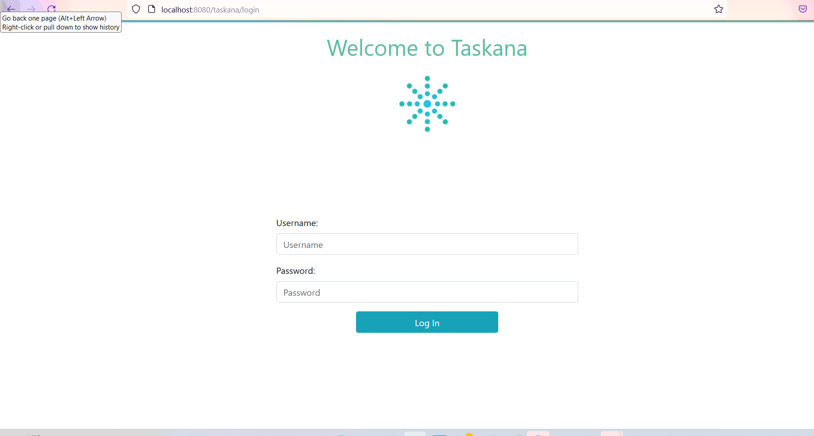

# Example Spring Boot

### Step 1: Initialize an empty project

Go to [Spring Initializer](https://start.spring.io/) and create an example project. Choose the same options as in the Screenshot, then click on "Generate"


Unpack the project and open it in InelliJ


### Step 2: Add dependencies
Add following dependencies to the pom in the demo project:

1. ldap and security dependencies:
```
<dependency>
    <groupId>org.springframework.ldap</groupId>
    <artifactId>spring-ldap-core</artifactId>
</dependency>
<dependency>
    <groupId>org.springframework.security</groupId>
    <artifactId>spring-security-ldap</artifactId>
</dependency>
<dependency>
    <groupId>com.unboundid</groupId>
    <artifactId>unboundid-ldapsdk</artifactId>
</dependency>
<dependency>
    <groupId>org.springframework.boot</groupId>
    <artifactId>spring-boot-starter-security</artifactId>
</dependency>
```
2. database dependencies:

```
<dependency>
    <groupId>com.h2database</groupId>
    <artifactId>h2</artifactId>
</dependency>
<dependency>
    <groupId>org.springframework.boot</groupId>
    <artifactId>spring-boot-starter-jdbc</artifactId>
<dependency>
```
3. taskana dependencies:

```
<dependency>
    <groupId>pro.taskana</groupId>
    <artifactId>taskana-common-data</artifactId>
    <version>5.7.0</version>
</dependency>
<dependency>
    <groupId>pro.taskana</groupId>
    <artifactId>taskana-web</artifactId>
    <version>5.7.0</version>
</dependency>
<dependency>
    <groupId>pro.taskana</groupId>
    <artifactId>taskana-common-logging</artifactId>
    <version>5.7.0</version>
</dependency>
<dependency>
    <groupId>pro.taskana</groupId>
    <artifactId>taskana-rest-spring</artifactId>
    <version>5.7.0</version>
</dependency>
```
4. web dependencies:

```
<dependency>
    <groupId>org.springframework.boot</groupId>
    <artifactId>spring-boot-starter-web</artifactId>
</dependency>
<dependency>
    <groupId>org.springframework.boot</groupId>
    <artifactId>spring-boot-starter-thymeleaf</artifactId>
</dependency>
```

5. spring depenpendencies:

```
<dependency>
    <groupId>org.springframework.plugin</groupId>
    <artifactId>spring-plugin-core</artifactId>
    <version>2.0.0.RELEASE</version>
</dependency>


```

** All dependencies **

```
<dependency>
    <groupId>org.springframework.boot</groupId>
    <artifactId>spring-boot-starter-web</artifactId>
</dependency>
<dependency>
    <groupId>org.springframework.boot</groupId>
    <artifactId>spring-boot-starter-thymeleaf</artifactId>
</dependency>
<dependency>
    <groupId>org.springframework.plugin</groupId>
    <artifactId>spring-plugin-core</artifactId>
    <version>2.0.0.RELEASE</version>
</dependency>
<dependency>
    <groupId>pro.taskana</groupId>
    <artifactId>taskana-web</artifactId>
    <version>5.7.0</version>
</dependency>
<dependency>
    <groupId>pro.taskana</groupId>
    <artifactId>taskana-common-logging</artifactId>
    <version>5.7.0</version>
</dependency>
<dependency>
    <groupId>pro.taskana</groupId>
    <artifactId>taskana-rest-spring</artifactId>
    <version>5.7.0</version>
</dependency>
<dependency>
    <groupId>pro.taskana</groupId>
    <artifactId>taskana-common-data</artifactId>
    <version>5.7.0</version>
</dependency>
<dependency>
    <groupId>org.springframework.ldap</groupId>
    <artifactId>spring-ldap-core</artifactId>
</dependency>
<dependency>
    <groupId>org.springframework.security</groupId>
    <artifactId>spring-security-ldap</artifactId>
</dependency>
<dependency>
    <groupId>com.unboundid</groupId>
    <artifactId>unboundid-ldapsdk</artifactId>
</dependency>
<dependency>
    <groupId>org.springframework.boot</groupId>
    <artifactId>spring-boot-starter-security</artifactId>
</dependency>
<dependency>
    <groupId>com.h2database</groupId>
    <artifactId>h2</artifactId>
</dependency>
<dependency>
    <groupId>org.springframework.boot</groupId>
    <artifactId>spring-boot-starter-jdbc</artifactId>
<dependency>
```

### Step 3: Add properties configuration

The example already has the configuration file ```application.properties```. You need to add following content into that file:

```
logging.level.pro.taskana=INFO
logging.level.org.springframework.security=INFO

server.servlet.context-path=/taskana

taskana.routing.dmn.upload.path=/tmp/routing.dmn

######## Taskana DB #######
######## h2 configuration ########
spring.datasource.url=jdbc:h2:mem:taskana;NON_KEYWORDS=KEY,VALUE;IGNORECASE=TRUE;LOCK_MODE=0
spring.datasource.driverClassName=org.h2.Driver
spring.datasource.username=sa
spring.datasource.password=sa
taskana.schemaName=TASKANA

######## h2 console configuration ########
########spring.h2.console.enabled=true
########spring.h2.console.path=/h2-console

####### property that control rest api security deploy use true for no security.
devMode=false

# This property enables the support of XSRF tokens. This will not work together with devMode.
enableCsrf=true

####### property that control if the database is cleaned and sample data is generated
generateSampleData=true

####### JobScheduler cron expression that specifies when the JobSchedler runs
taskana.jobscheduler.async.cron=0 * * * * *
####### cache static resources properties
spring.web.resources.cache.cachecontrol.cache-private=true
####### for upload of big workbasket- or classification-files
spring.servlet.multipart.max-file-size=10MB
spring.servlet.multipart.max-request-size=10MB

####### serve compressed files for faster UI loading times
server.compression.enabled=true
server.compression.mime-types=application/json,application/xml,text/html,text/xml,text/plain,application/javascript,text/css,image/svg+xml
server.compression.min-response-size=10240

spring.main.allow-bean-definition-overriding=true

server.tomcat.max-http-form-post-size=-1
server.tomcat.max-save-post-size=-1
server.tomcat.max-swallow-size=-1
####### tomcat is not detecting the x-forward headers from bluemix as a trustworthy proxy
server.tomcat.remoteip.internal-proxies=.*
server.forward-headers-strategy=native

####### Properties for AccessIdController to connect to LDAP
taskana.ldap.serverUrl=ldap://localhost:10389
taskana.ldap.bindDn=uid=admin
taskana.ldap.bindPassword=secret
taskana.ldap.baseDn=ou=Test,O=TASKANA
taskana.ldap.userSearchBase=cn=users
taskana.ldap.userSearchFilterName=objectclass
taskana.ldap.userSearchFilterValue=person
taskana.ldap.userFirstnameAttribute=givenName
taskana.ldap.userLastnameAttribute=sn
taskana.ldap.userFullnameAttribute=cn
taskana.ldap.userPhoneAttribute=phoneNumber
taskana.ldap.userMobilePhoneAttribute=mobileNumber
taskana.ldap.userEmailAttribute=email
taskana.ldap.userOrglevel1Attribute=orgLevel1
taskana.ldap.userOrglevel2Attribute=orgLevel2
taskana.ldap.userOrglevel3Attribute=someDepartement
taskana.ldap.userOrglevel4Attribute=orgLevel4
taskana.ldap.userIdAttribute=uid
taskana.ldap.userMemberOfGroupAttribute=memberOf
taskana.ldap.groupSearchBase=
taskana.ldap.groupSearchFilterName=objectclass
taskana.ldap.groupSearchFilterValue=groupofuniquenames
taskana.ldap.groupNameAttribute=cn
taskana.ldap.minSearchForLength=3
taskana.ldap.maxNumberOfReturnedAccessIds=50
taskana.ldap.groupsOfUser=uniquemember

# Embedded Spring LDAP server
spring.ldap.embedded.base-dn= OU=Test,O=TASKANA
spring.ldap.embedded.credential.username= uid=admin
spring.ldap.embedded.credential.password= secret
spring.ldap.embedded.ldif=classpath:example-users.ldif
spring.ldap.embedded.port= 10389
spring.ldap.embedded.validation.enabled=false

```

You can read more about ```application.properties``` here (link).

Then, you should create ```taskana.properties``` in the recources folder. You can copy following content into that file:

```
taskana.roles.user=cn=ksc-users,cn=groups,OU=Test,O=TASKANA | teamlead-1 | teamlead-2 | user-1-1 | user-1-2 | user-2-1 | user-2-2 | user-b-1 | user-b-2
taskana.roles.admin=admin | uid=admin,cn=users,OU=Test,O=TASKANA
taskana.roles.businessadmin=businessadmin | cn=business-admins,cn=groups,OU=Test,O=TASKANA
taskana.roles.monitor=monitor | cn=monitor-users,cn=groups,OU=Test,O=TASKANA
taskana.roles.taskadmin=taskadmin
taskana.domains=DOMAIN_A,DOMAIN_B,DOMAIN_C,DOMAIN_TEST
taskana.user.minimalPermissionsToAssignDomains=READ | OPEN
taskana.classification.types=TASK,DOCUMENT
taskana.classification.categories.task=EXTERNAL, manual, autoMAtic, Process
taskana.classification.categories.document=EXTERNAL
taskana.jobs.maxRetries=3
taskana.jobs.batchSize=50
taskana.jobs.cleanup.runEvery=P1D
taskana.jobs.cleanup.firstRunAt=2018-07-25T08:00:00Z
taskana.jobs.cleanup.minimumAge=P14D
taskana.jobs.history.batchSize=50
taskana.jobs.history.cleanup.firstRunAt=2018-07-25T08:00:00Z
taskana.jobs.history.cleanup.minimumAge=P14D
taskana.jobs.history.cleanup.runEvery=P1D
taskana.jobs.user.refresh.runEvery=P1D
taskana.jobs.user.refresh.firstRunAt=2018-07-25T23:00:00Z
taskana.german.holidays.enabled=true
taskana.german.holidays.corpus-christi.enabled=true
taskana.historylogger.name=AUDIT
taskana.routing.dmn=/dmn-table.dmn
```

See here (link) for more details and configuration options.

### Step 4: Add rest configuration
Add a ```config``` folder into the com.example.demo package (in src/main/java/com/example/demo). This folder will contain a file with the REST configuration of the project. Create a java class with the name ```ExampleRestConfiguration``` there. This class defines the Beans and their dependencies. Copy following content into that class:

```
package com.example.demo.config;

import org.springframework.beans.factory.annotation.Value;
import org.springframework.context.annotation.Bean;
import org.springframework.context.annotation.Configuration;
import org.springframework.context.annotation.DependsOn;
import org.springframework.jdbc.datasource.DataSourceTransactionManager;
import org.springframework.transaction.PlatformTransactionManager;
import pro.taskana.TaskanaEngineConfiguration;
import pro.taskana.common.api.TaskanaEngine;
import pro.taskana.common.internal.configuration.DbSchemaCreator;
import pro.taskana.sampledata.SampleDataGenerator;

import javax.sql.DataSource;
import java.sql.SQLException;

@Configuration
public class ExampleRestConfiguration {

    @Bean
    public PlatformTransactionManager txManager(DataSource dataSource) {
        return new DataSourceTransactionManager(dataSource);
    }

    @Bean
    @DependsOn("taskanaEngineConfiguration") // generate sample data after schema was inserted
    public SampleDataGenerator generateSampleData(
            TaskanaEngineConfiguration taskanaEngineConfiguration,
            DataSource dataSource,
            @Value("${generateSampleData:true}") boolean generateSampleData)
            throws SQLException {
        DbSchemaCreator dbSchemaCreator =
                new DbSchemaCreator(dataSource, taskanaEngineConfiguration.getSchemaName());
        dbSchemaCreator.run();
        SampleDataGenerator sampleDataGenerator =
                new SampleDataGenerator(dataSource, taskanaEngineConfiguration.getSchemaName());
        if (generateSampleData) {
            sampleDataGenerator.generateSampleData();
        }
        return sampleDataGenerator;
    }

    @Bean
    @DependsOn("generateSampleData")
    public TaskanaEngine getTaskanaEngine(TaskanaEngineConfiguration taskanaEngineConfiguration)
            throws SQLException {
        return taskanaEngineConfiguration.buildTaskanaEngine();
    }
}

```

### Step 5: Add controllers
Add a ```controller``` folder into the com.example.demo package (in src/main/java/com/example/demo). This folder will contain the controllers for different paths. Our application needs following three controllers:
- LoginController
- ResourcesController
- ViewController

Create three java classes with names LoginController, ResourcesController and ViewController. The LoginController will handle the login into taskana. It will need the template/login.html in the recources folder. Please copy the template folder from here: (link). Then, copy following code into LoginController:

```
package com.example.demo.controller;

import org.springframework.core.Ordered;
import org.springframework.stereotype.Controller;
import org.springframework.web.servlet.config.annotation.ViewControllerRegistry;
import org.springframework.web.servlet.config.annotation.WebMvcConfigurer;

@Controller
public class LoginController implements WebMvcConfigurer {

    @Override
    public void addViewControllers(ViewControllerRegistry registry) {
        registry.addViewController("/login").setViewName("login");
        registry.setOrder(Ordered.HIGHEST_PRECEDENCE);
    }
}
```
The ResourcesController handles resources like images and additional customizations. Copy the "static" folder from here (link) into the recources folder. Then add a controllers folder into the recources. Create a ```taskana-customization.json``` file inside the controllers folder. Then, please copy following code into the ResourcesController:

```
package com.example.demo.controller;

import org.springframework.http.MediaType;
import org.springframework.http.ResponseEntity;
import org.springframework.stereotype.Controller;
import org.springframework.web.bind.annotation.GetMapping;
import pro.taskana.common.internal.util.ResourceUtil;

import java.io.IOException;

@Controller
public class ResourcesController {

    public static final String TASKANA_CUSTOMIZATION_FILE_NAME = "taskana-customization.json";

    @GetMapping(
            value = "/environments/data-sources/taskana-customization.json",
            produces = MediaType.APPLICATION_JSON_VALUE)
    public ResponseEntity<String> taskanaCustomization() throws IOException {
        return ResponseEntity.ok(readResourceAsString(TASKANA_CUSTOMIZATION_FILE_NAME));
    }

    // the environment-information.json file will be served via "static" folder
    //  @GetMapping(
    //      value = "/environments/data-sources/environment-information.json",
    //      produces = MediaType.APPLICATION_JSON_VALUE)
    //  public ResponseEntity<String> environmentInformation() throws Exception {
    //    return ResponseEntity.ok(readResourceAsString("environment-information.json"));
    //  }

    private String readResourceAsString(String resource) throws IOException {
        String resourceAsString = ResourceUtil.readResourceAsString(getClass(), resource);
        if (resourceAsString == null) {
            return "{}";
        }
        return resourceAsString;
    }
}
```

The ViewController manages the root view of taskana. It consists of following code:

```
package com.example.demo.controller;

import org.springframework.stereotype.Controller;
import org.springframework.web.bind.annotation.GetMapping;

/** The view controller. */
@Controller
public class ViewController {

    @GetMapping(path = {"", "taskana/**"})
    public String index() {
        return "forward:/index.html";
    }
}
```

### Step 6: Add security

Add a ```security``` folder into the com.example.demo package (in src/main/java/com/example/demo). This folder will contain the ldap-security. The ldap-security consists of one configurer class: ```BootWebSecurityConfigurer``` (will be replaced), one mvc configuration for handling recources and messages of the application: ```WebMvcConfig```, and one example configuration ```ExampleWebSecurityConfig```. Please create the three java classes inside the ```security``` folder.

Copy following content into the ```BootWebSecurityConfigurer```:

```
package com.example.demo.security;

import org.springframework.beans.factory.annotation.Value;
import org.springframework.http.HttpMethod;
import org.springframework.security.config.annotation.authentication.builders.AuthenticationManagerBuilder;
import org.springframework.security.config.annotation.web.builders.HttpSecurity;
import org.springframework.security.config.annotation.web.configuration.EnableWebSecurity;
import org.springframework.security.config.annotation.web.configuration.WebSecurityConfigurerAdapter;
import org.springframework.security.core.authority.mapping.GrantedAuthoritiesMapper;
import org.springframework.security.ldap.userdetails.LdapAuthoritiesPopulator;
import org.springframework.security.web.csrf.CookieCsrfTokenRepository;
import org.springframework.security.web.jaasapi.JaasApiIntegrationFilter;
import org.springframework.security.web.util.matcher.AntPathRequestMatcher;
import pro.taskana.common.rest.SpringSecurityToJaasFilter;

/** Default basic configuration for taskana web example. */
@EnableWebSecurity
public class BootWebSecurityConfigurer extends WebSecurityConfigurerAdapter {

    private final LdapAuthoritiesPopulator ldapAuthoritiesPopulator;
    private final GrantedAuthoritiesMapper grantedAuthoritiesMapper;

    private final String ldapServerUrl;
    private final String ldapBaseDn;
    private final String ldapGroupSearchBase;
    private final String ldapUserDnPatterns;

    private final boolean devMode;
    private final boolean enableCsrf;

    public BootWebSecurityConfigurer(
            @Value("${taskana.ldap.serverUrl:ldap://localhost:10389}") String ldapServerUrl,
            @Value("${taskana.ldap.baseDn:OU=Test,O=TASKANA}") String ldapBaseDn,
            @Value("${taskana.ldap.groupSearchBase:cn=groups}") String ldapGroupSearchBase,
            @Value("${taskana.ldap.userDnPatterns:uid={0},cn=users}") String ldapUserDnPatterns,
            @Value("${enableCsrf:false}") boolean enableCsrf,
            LdapAuthoritiesPopulator ldapAuthoritiesPopulator,
            GrantedAuthoritiesMapper grantedAuthoritiesMapper,
            @Value("${devMode:false}") boolean devMode) {
        this.enableCsrf = enableCsrf;
        this.ldapAuthoritiesPopulator = ldapAuthoritiesPopulator;
        this.grantedAuthoritiesMapper = grantedAuthoritiesMapper;
        this.ldapServerUrl = ldapServerUrl;
        this.ldapBaseDn = ldapBaseDn;
        this.ldapGroupSearchBase = ldapGroupSearchBase;
        this.ldapUserDnPatterns = ldapUserDnPatterns;
        this.devMode = devMode;
    }

    @Override
    protected void configure(AuthenticationManagerBuilder auth) throws Exception {
        auth.ldapAuthentication()
                .userDnPatterns(ldapUserDnPatterns)
                .groupSearchBase(ldapGroupSearchBase)
                .ldapAuthoritiesPopulator(ldapAuthoritiesPopulator)
                .authoritiesMapper(grantedAuthoritiesMapper)
                .contextSource()
                .url(ldapServerUrl + "/" + ldapBaseDn)
                .and()
                .passwordCompare()
                .passwordAttribute("userPassword");
    }

    @Override
    protected void configure(HttpSecurity http) throws Exception {
        HttpSecurity httpSecurity =
                http.authorizeRequests()
                        .antMatchers("/css/**", "/img/**")
                        .permitAll()
                        .and()
                        .authorizeRequests()
                        .antMatchers(HttpMethod.GET, "/docs/**")
                        .permitAll()
                        .and()
                        .addFilter(jaasApiIntegrationFilter())
                        .addFilterAfter(new SpringSecurityToJaasFilter(), JaasApiIntegrationFilter.class);

        if (enableCsrf) {
            CookieCsrfTokenRepository csrfTokenRepository = CookieCsrfTokenRepository.withHttpOnlyFalse();
            csrfTokenRepository.setCookiePath("/");
            httpSecurity.csrf().csrfTokenRepository(csrfTokenRepository);
        } else {
            httpSecurity.csrf().disable().httpBasic();
        }

        if (devMode) {
            http.headers()
                    .frameOptions()
                    .sameOrigin()
                    .and()
                    .authorizeRequests()
                    .antMatchers("/h2-console/**")
                    .permitAll();
        } else {
            addLoginPageConfiguration(http);
        }
    }

    protected void addLoginPageConfiguration(HttpSecurity http) throws Exception {
        http.authorizeRequests()
                .anyRequest()
                .fullyAuthenticated()
                .and()
                .formLogin()
                .loginPage("/login")
                .failureUrl("/login?error")
                .defaultSuccessUrl("/")
                .permitAll()
                .and()
                .logout()
                .invalidateHttpSession(true)
                .clearAuthentication(true)
                .logoutRequestMatcher(new AntPathRequestMatcher("/logout"))
                .logoutSuccessUrl("/login?logout")
                .deleteCookies("JSESSIONID")
                .permitAll();
    }

    protected JaasApiIntegrationFilter jaasApiIntegrationFilter() {
        JaasApiIntegrationFilter filter = new JaasApiIntegrationFilter();
        filter.setCreateEmptySubject(true);
        return filter;
    }
}
```

Then copy following content into ```WebMvcConroller```:

```
package com.example.demo.security;

import com.fasterxml.jackson.databind.ObjectMapper;
import com.fasterxml.jackson.databind.SerializationFeature;
import org.springframework.beans.factory.annotation.Autowired;
import org.springframework.context.annotation.Configuration;
import org.springframework.http.converter.HttpMessageConverter;
import org.springframework.http.converter.json.MappingJackson2HttpMessageConverter;
import org.springframework.web.servlet.config.annotation.EnableWebMvc;
import org.springframework.web.servlet.config.annotation.ResourceHandlerRegistry;
import org.springframework.web.servlet.config.annotation.WebMvcConfigurer;

import javax.annotation.PostConstruct;
import java.util.List;

/**
 * The Web MVC Configuration.
 */
@Configuration
@EnableWebMvc
public class WebMvcConfig implements WebMvcConfigurer {

    private static final String[] CLASSPATH_RESOURCE_LOCATIONS = {
            "classpath:/META-INF/resources/", "classpath:/resources/",
            "classpath:/static/", "classpath:/public/"
    };

    private final ObjectMapper objectMapper;

    @Autowired
    public WebMvcConfig(ObjectMapper objectMapper) {
        this.objectMapper = objectMapper;
    }

    @Override
    public void addResourceHandlers(ResourceHandlerRegistry registry) {
        if (!registry.hasMappingForPattern("/webjars/**")) {
            registry
                    .addResourceHandler("/webjars/**")
                    .addResourceLocations("classpath:/META-INF/resources/webjars/");
        }
        if (!registry.hasMappingForPattern("/**")) {
            registry.addResourceHandler("/**").addResourceLocations(CLASSPATH_RESOURCE_LOCATIONS);
        }
    }

    @Override
    public void extendMessageConverters(List<HttpMessageConverter<?>> converters) {
        for (HttpMessageConverter<?> converter : converters) {
            if (converter instanceof MappingJackson2HttpMessageConverter) {
                MappingJackson2HttpMessageConverter jacksonConverter =
                        (MappingJackson2HttpMessageConverter) converter;
                jacksonConverter.setPrettyPrint(true);
            }
        }
    }

    @PostConstruct
    public void enableObjectIndent() {
        objectMapper.enable(SerializationFeature.INDENT_OUTPUT);
    }
}

```

Then add following ```ExampleWebConfig```:

```
package com.example.demo.security;

import org.springframework.beans.factory.annotation.Autowired;
import org.springframework.beans.factory.annotation.Value;
import org.springframework.boot.web.servlet.FilterRegistrationBean;
import org.springframework.context.annotation.Bean;
import org.springframework.context.annotation.Configuration;
import org.springframework.security.core.GrantedAuthority;
import org.springframework.security.core.authority.SimpleGrantedAuthority;
import org.springframework.security.core.authority.mapping.GrantedAuthoritiesMapper;
import org.springframework.security.core.authority.mapping.SimpleAuthorityMapper;
import org.springframework.security.ldap.DefaultSpringSecurityContextSource;
import org.springframework.security.ldap.userdetails.DefaultLdapAuthoritiesPopulator;
import org.springframework.security.ldap.userdetails.LdapAuthoritiesPopulator;
import org.springframework.web.cors.CorsConfiguration;
import org.springframework.web.cors.UrlBasedCorsConfigurationSource;
import org.springframework.web.filter.CorsFilter;
import org.springframework.web.servlet.config.annotation.CorsRegistry;
import org.springframework.web.servlet.config.annotation.WebMvcConfigurer;

import java.util.List;
import java.util.Map;
import java.util.function.Function;

@Configuration
public class ExampleWebSecurityConfig {

    private final String ldapServerUrl;
    private final String ldapBaseDn;
    private final String ldapGroupSearchBase;
    private final String ldapGroupSearchFilter;

    @Autowired
    public ExampleWebSecurityConfig(
            @Value("${taskana.ldap.serverUrl:ldap://localhost:10389}") String ldapServerUrl,
            @Value("${taskana.ldap.baseDn:OU=Test,O=TASKANA}") String ldapBaseDn,
            @Value("${taskana.ldap.groupSearchBase:cn=groups}") String ldapGroupSearchBase,
            @Value("${taskana.ldap.groupSearchFilter:uniqueMember={0}}") String ldapGroupSearchFilter) {
        this.ldapServerUrl = ldapServerUrl;
        this.ldapBaseDn = ldapBaseDn;
        this.ldapGroupSearchBase = ldapGroupSearchBase;
        this.ldapGroupSearchFilter = ldapGroupSearchFilter;
    }

    @Bean
    public WebMvcConfigurer corsConfigurer() {
        return new CorsWebMvcConfigurer();
    }

    @Bean
    public FilterRegistrationBean<CorsFilter> corsFilter() {
        final UrlBasedCorsConfigurationSource source = new UrlBasedCorsConfigurationSource();
        CorsConfiguration config = new CorsConfiguration();
        config.setAllowCredentials(true);
        config.addAllowedOriginPattern("*");
        config.addAllowedHeader("*");
        config.addAllowedMethod("*");
        source.registerCorsConfiguration("/**", config);
        FilterRegistrationBean<CorsFilter> bean = new FilterRegistrationBean<>(new CorsFilter(source));
        bean.setOrder(0);
        return bean;
    }

    @Bean
    public LdapAuthoritiesPopulator authoritiesPopulator(
            DefaultSpringSecurityContextSource contextSource) {
        Function<Map<String, List<String>>, GrantedAuthority> authorityMapper =
                recordVar -> new SimpleGrantedAuthority(recordVar.get("spring.security.ldap.dn").get(0));

        DefaultLdapAuthoritiesPopulator populator =
                new DefaultLdapAuthoritiesPopulator(contextSource, ldapGroupSearchBase);
        populator.setGroupSearchFilter(ldapGroupSearchFilter);
        populator.setSearchSubtree(true);
        populator.setRolePrefix("");
        populator.setAuthorityMapper(authorityMapper);
        return populator;
    }

    @Bean
    public DefaultSpringSecurityContextSource defaultSpringSecurityContextSource() {
        return new DefaultSpringSecurityContextSource(ldapServerUrl + "/" + ldapBaseDn);
    }

    @Bean
    public GrantedAuthoritiesMapper grantedAuthoritiesMapper() {
        SimpleAuthorityMapper grantedAuthoritiesMapper = new SimpleAuthorityMapper();
        grantedAuthoritiesMapper.setPrefix("");
        return grantedAuthoritiesMapper;
    }

    private static class CorsWebMvcConfigurer implements WebMvcConfigurer {

        @Override
        public void addCorsMappings(CorsRegistry registry) {
            registry.addMapping("/**").allowedOrigins("*");
        }
    }
}

```

In order for security to work, we need to define ldap users. Please create an ```example-users.ldif``` file in the resouces folder. Fill the file with following content:

```
######################
# Base Structure
######################
dn: OU=Test,O=TASKANA
ou: Organisationseinheit
objectclass: top
objectclass: organizationalUnit

dn: cn=groups,OU=Test,O=TASKANA
cn: groups
objectclass: top
objectclass: container

dn: cn=users,OU=Test,O=TASKANA
cn: users
objectclass: top
objectclass: container

dn: cn=organisation,OU=Test,O=TASKANA
cn: organisation
objectclass: top
objectclass: container


########################
# Users General
########################
dn: uid=monitor,cn=users,OU=Test,O=TASKANA
objectclass: inetorgperson
objectclass: organizationalperson
objectclass: person
objectclass: top
givenName: Monitor
description: desc
uid: monitor
sn: Monitor
ou: Organisationseinheit/Organisationseinheit IT
cn: monitor monitor
userPassword: monitor

dn: uid=taskadmin,cn=users,OU=Test,O=TASKANA
objectclass: inetorgperson
objectclass: organizationalperson
objectclass: person
objectclass: top
givenName: Task
description: desc
uid: taskadmin
sn: Admin
ou: Organisationseinheit/Organisationseinheit IT
cn: Task admin
userPassword: taskadmin

dn: uid=admin,cn=users,OU=Test,O=TASKANA
objectclass: inetorgperson
objectclass: organizationalperson
objectclass: person
objectclass: top
givenName: Admin
description: desc
uid: admin
sn: Admin
ou: Organisationseinheit/Organisationseinheit IT
cn: Admin Admin
userPassword: admin

dn: uid=businessadmin,cn=users,OU=Test,O=TASKANA
objectclass: inetorgperson
objectclass: organizationalperson
objectclass: person
objectclass: top
givenName: Business
description: desc
memberOf: cn=business-admins,cn=groups,OU=Test,O=TASKANA
uid: businessadmin
sn: Admin
ou: Organisationseinheit/Organisationseinheit IT
cn: Business Admin
userPassword: businessadmin

########################
# Users KSC 1
########################
dn: uid=teamlead-1,cn=users,OU=Test,O=TASKANA
objectclass: inetorgperson
objectclass: organizationalperson
objectclass: person
objectclass: top
givenName: Titus
description: desc
phoneNumber: 012345678
mobileNumber: 09876554321
email: Titus.Toll@taskana.de
orgLevel1: QWERT
orgLevel2: DEF/GHI
someDepartement: JKL
orgLevel4: MNO/PQR
memberOf: cn=Organisationseinheit KSC 1,cn=Organisationseinheit KSC,cn=organisation,OU=Test,O=TASKANA
memberOf: cn=monitor-users,cn=groups,OU=Test,O=TASKANA
memberOf: cn=business-admins,cn=groups,OU=Test,O=TASKANA
memberOf: cn=ksc-teamleads,cn=groups,OU=Test,O=TASKANA
uid: teamlead-1
sn: Toll
ou: Organisationseinheit/Organisationseinheit KSC/Organisationseinheit KSC 1
cn: Titus Toll
userPassword: teamlead-1

dn: uid=user-1-1,cn=users,OU=Test,O=TASKANA
objectclass: inetorgperson
objectclass: organizationalperson
objectclass: person
objectclass: top
givenName: Max
description: desc
memberOf: cn=ksc-users,cn=groups,OU=Test,O=TASKANA
memberOf: cn=Organisationseinheit KSC 1,cn=Organisationseinheit KSC,cn=organisation,OU=Test,O=TASKANA
uid: user-1-1
sn: Mustermann
ou: Organisationseinheit/Organisationseinheit KSC/Organisationseinheit KSC 1
cn: Max Mustermann
userPassword: user-1-1

dn: uid=user-1-2,cn=users,OU=Test,O=TASKANA
objectclass: inetorgperson
objectclass: organizationalperson
objectclass: person
objectclass: top
givenName: Elena
description: desc
memberOf: cn=ksc-users,cn=groups,OU=Test,O=TASKANA
memberOf: cn=Organisationseinheit KSC 1,cn=Organisationseinheit KSC,cn=organisation,OU=Test,O=TASKANA
uid: user-1-2
sn: Eifrig
ou: Organisationseinheit/Organisationseinheit KSC/Organisationseinheit KSC 1
cn: Elena Eifrig
userPassword: user-1-2

dn: uid=user-1-3,cn=users,OU=Test,O=TASKANA
objectclass: inetorgperson
objectclass: organizationalperson
objectclass: person
objectclass: top
givenName: Elena
description: desc
uid: user-1-3
sn: Faul
ou: Organisationseinheit/Organisationseinheit KSC/Organisationseinheit KSC 1
cn: Elena Faul
userPassword: user-1-3

########################
# Users KSC 2
########################
dn: uid=teamlead-2,cn=users,OU=Test,O=TASKANA
objectclass: inetorgperson
objectclass: organizationalperson
objectclass: person
objectclass: top
givenName: Frauke
description: desc
memberOf: cn=Organisationseinheit KSC 2,cn=Organisationseinheit KSC,cn=organisation,OU=Test,O=TASKANA
memberOf: cn=monitor-users,cn=groups,OU=Test,O=TASKANA
memberOf: cn=business-admins,cn=groups,OU=Test,O=TASKANA
memberOf: cn=ksc-teamleads,cn=groups,OU=Test,O=TASKANA
uid: teamlead-2
sn: Faul
ou: Organisationseinheit/Organisationseinheit KSC/Organisationseinheit KSC 2
cn: Frauke Faul
userPassword: teamlead-2

dn: uid=user-2-1,cn=users,OU=Test,O=TASKANA
objectclass: inetorgperson
objectclass: organizationalperson
objectclass: person
objectclass: top
givenName: Simone
description: desc
memberOf: cn=Organisationseinheit KSC 2,cn=Organisationseinheit KSC,cn=organisation,OU=Test,O=TASKANA
memberOf: cn=ksc-users,cn=groups,OU=Test,O=TASKANA
uid: user-2-1
sn: Müller
ou: Organisationseinheit/Organisationseinheit KSC/Organisationseinheit KSC 2
cn: Simone Müller
userPassword: user-2-1

dn: uid=user-2-2,cn=users,OU=Test,O=TASKANA
objectclass: inetorgperson
objectclass: organizationalperson
objectclass: person
objectclass: top
givenName: Tim
description: desc
memberOf: cn=Organisationseinheit KSC 2,cn=Organisationseinheit KSC,cn=organisation,OU=Test,O=TASKANA
memberOf: cn=ksc-users,cn=groups,OU=Test,O=TASKANA
uid: user-2-2
sn:: U2NobMOkZnJpZw==
ou: Organisationseinheit/Organisationseinheit KSC/Organisationseinheit KSC 2
cn:: VGltIFNjaGzDpGZyaWc=
userPassword: user-2-2

dn: uid=user-2-3,cn=users,OU=Test,O=TASKANA
objectclass: inetorgperson
objectclass: organizationalperson
objectclass: person
objectclass: top
givenName: Thomas
description: desc
memberOf: cn=Organisationseinheit KSC 2,cn=Organisationseinheit KSC,cn=organisation,OU=Test,O=TASKANA
uid: user-2-3
sn: Bach
ou: Organisationseinheit/Organisationseinheit KSC/Organisationseinheit KSC 2
cn: Thomas Bach
userPassword: user-2-3

dn: uid=user-2-4,cn=users,OU=Test,O=TASKANA
objectclass: inetorgperson
objectclass: organizationalperson
objectclass: person
objectclass: top
givenName: Rolf
description: desc
memberOf: cn=Organisationseinheit KSC 2,cn=Organisationseinheit KSC,cn=organisation,OU=Test,O=TASKANA
uid: user-2-4
sn: Wieland
ou: Organisationseinheit/Organisationseinheit KSC/Organisationseinheit KSC 2
cn: Rolf Wieland
userPassword: user-2-4

dn: uid=user-2-5,cn=users,OU=Test,O=TASKANA
objectclass: inetorgperson
objectclass: organizationalperson
objectclass: person
objectclass: top
givenName: Heike
description: desc
memberOf: cn=Organisationseinheit KSC 2,cn=Organisationseinheit KSC,cn=organisation,OU=Test,O=TASKANA
uid: user-2-5
sn: Schmidt
ou: Organisationseinheit/Organisationseinheit KSC/Organisationseinheit KSC 2
cn: Heike Schmidt
userPassword: user-2-5

dn: uid=user-2-6,cn=users,OU=Test,O=TASKANA
objectclass: inetorgperson
objectclass: organizationalperson
objectclass: person
objectclass: top
givenName: Kurt
description: desc
memberOf: cn=Organisationseinheit KSC 2,cn=Organisationseinheit KSC,cn=organisation,OU=Test,O=TASKANA
uid: user-2-6
sn: Maier
ou: Organisationseinheit/Organisationseinheit KSC/Organisationseinheit KSC 2
cn: Kurt Maier
userPassword: user-2-6

dn: uid=user-2-7,cn=users,OU=Test,O=TASKANA
objectclass: inetorgperson
objectclass: organizationalperson
objectclass: person
objectclass: top
givenName: Wiebke
description: desc
memberOf: cn=Organisationseinheit KSC 2,cn=Organisationseinheit KSC,cn=organisation,OU=Test,O=TASKANA
uid: user-2-7
sn: Meyer
ou: Organisationseinheit/Organisationseinheit KSC/Organisationseinheit KSC 2
cn: Wiebke Meyer
userPassword: user-2-7

dn: uid=user-2-8,cn=users,OU=Test,O=TASKANA
objectclass: inetorgperson
objectclass: organizationalperson
objectclass: person
objectclass: top
givenName: Jana
description: desc
memberOf: cn=Organisationseinheit KSC 2,cn=Organisationseinheit KSC,cn=organisation,OU=Test,O=TASKANA
uid: user-2-8
sn: Heeg
ou: Organisationseinheit/Organisationseinheit KSC/Organisationseinheit KSC 2
cn: Jana Heeg
userPassword: user-2-8

dn: uid=user-2-9,cn=users,OU=Test,O=TASKANA
objectclass: inetorgperson
objectclass: organizationalperson
objectclass: person
objectclass: top
givenName: Nathalie
description: desc
memberOf: cn=Organisationseinheit KSC 2,cn=Organisationseinheit KSC,cn=organisation,OU=Test,O=TASKANA
uid: user-2-9
sn: Fuchs
ou: Organisationseinheit/Organisationseinheit KSC/Organisationseinheit KSC 2
cn: Nathalie Fuchs
userPassword: user-2-9

dn: uid=user-2-10,cn=users,OU=Test,O=TASKANA
objectclass: inetorgperson
objectclass: organizationalperson
objectclass: person
objectclass: top
givenName: Johannes
description: desc
memberOf: cn=Organisationseinheit KSC 2,cn=Organisationseinheit KSC,cn=organisation,OU=Test,O=TASKANA
uid: user-2-10
sn: Renz
ou: Organisationseinheit/Organisationseinheit KSC/Organisationseinheit KSC 2
cn: Johannes Renz
userPassword: user-2-10

dn: uid=das_ist_eine_sehr_sehr_sehr_sehr_sehr_lange_user_id,cn=users,OU=Test,O=TASKANA
objectclass: inetorgperson
objectclass: organizationalperson
objectclass: person
objectclass: top
givenName: Max
description: desc
memberOf: cn=Organisationseinheit KSC 2,cn=Organisationseinheit KSC,cn=organisation,OU=Test,O=TASKANA
uid: das_ist_eine_sehr_sehr_sehr_sehr_sehr_lange_user_id
sn: Renz
ou: Organisationseinheit/Organisationseinheit KSC/Organisationseinheit KSC 2
cn: Max Renz
userPassword: user-2-11

########################
# Users Domäne B
########################
dn: uid=user-b-1,cn=users,OU=Test,O=TASKANA
objectclass: inetorgperson
objectclass: organizationalperson
objectclass: person
objectclass: top
givenName: Bernd
description: desc
uid: user-b-1
sn: Bern
ou: Organisationseinheit/Organisationseinheit B
cn: Bernd Bern
userPassword: user-b-1

dn: uid=User-b-2,cn=users,OU=Test,O=TASKANA
objectclass: inetorgperson
objectclass: organizationalperson
objectclass: person
objectclass: top
givenName: Brunhilde
description: desc
uid: User-b-2
sn: Bio
ou: Organisationseinheit/Organisationseinheit B
cn: Brunhilde Bio
userPassword: user-b-2


########################
# Groups
########################
dn: cn=ksc-users,cn=groups,OU=Test,O=TASKANA
uniquemember: uid=user-1-1,cn=users,OU=Test,O=TASKANA
uniquemember: uid=user-1-2,cn=users,OU=Test,O=TASKANA
uniquemember: uid=user-2-1,cn=users,OU=Test,O=TASKANA
uniquemember: uid=user-2-2,cn=users,OU=Test,O=TASKANA
cn: ksc-users
objectclass: groupofuniquenames
objectclass: top

dn: cn=ksc-teamleads,cn=groups,OU=Test,O=TASKANA
uniquemember: uid=teamlead-1,cn=users,OU=Test,O=TASKANA
uniquemember: uid=teamlead-2,cn=users,OU=Test,O=TASKANA
cn: ksc-teamleads
objectclass: groupofuniquenames
objectclass: top

dn: cn=business-admins,cn=groups,OU=Test,O=TASKANA
uniquemember: uid=teamlead-1,cn=users,OU=Test,O=TASKANA
uniquemember: uid=teamlead-2,cn=users,OU=Test,O=TASKANA
uniquemember: uid=businessadmin,cn=users,OU=Test,O=TASKANA
cn: business-admins
objectclass: groupofuniquenames
objectclass: top

dn: cn=monitor-users,cn=groups,OU=Test,O=TASKANA
uniquemember: uid=teamlead-1,cn=users,OU=Test,O=TASKANA
uniquemember: uid=teamlead-2,cn=users,OU=Test,O=TASKANA
cn: monitor-users
objectclass: groupofuniquenames
objectclass: top

######################
# Organizational Units
######################
dn: cn=Organisationseinheit KSC,cn=organisation,OU=Test,O=TASKANA
cn: Organisationseinheit KSC
uniquemember: cn=Organisationseinheit KSC 1,cn=Organisationseinheit KSC,cn=organisation,OU=Test,O=TASKANA
uniquemember: cn=Organisationseinheit KSC 2,cn=Organisationseinheit KSC,cn=organisation,OU=Test,O=TASKANA
objectclass: groupofuniquenames

```

### Step 8: Start and open the application

Type ```localhost:8080/taskana``` into your browser. You should see the login screen:



Log in using "admin" as username and "admin" as password. Now, you should see following:


Here, you can open an existing Workbasket or add a new one. Press the menu button in the upper left to navigate.


